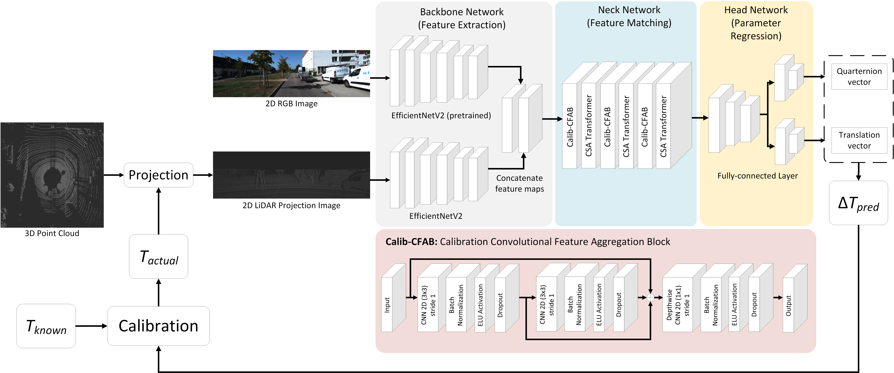

# LiDAR-Camera Extrinsic Calibration
This repository provides a project about deep-learning-based targetless extrinsic calibration for LiDAR--Camera system.

## Table of Contents
- [About the Project](#about-the-project)
    * [Problem Formulation](#problem-formulation)
    * [Data Preprocessing](#data-preprocessing)
    * [Model Architecture](#model-architecture)
- [Getting Started](#getting-started)
    * [Requirements](#requirements)
    * [Training](#training)
    * [Evaluation](#evaluation)
- [Current Result](#current-result)
- [Contacts](#contacts)
- [Acknowledgments](#acknowledgments)

## About the Project 
This project was part of the sensor fusion and computer fusion research project at [WiComAI Lab](https://wireless.kookmin.ac.kr/) of Kookmin University, Seoul, South Korea. 
The project aims to predicts the misalignment in the extrinsic parameters between the camera and LiDAR by leveraging [EfficientNetV2](https://arxiv.org/abs/2104.00298) 
as feature extraction network and CSA transformer from [Lite Vision Transformer](https://arxiv.org/abs/2112.10809) as feature matching network. The deep learning network is trained 
and tested using the [KITTI Odometry dataset](https://www.cvlibs.net/datasets/kitti/eval_odometry.php).

#### Problem Formulation
Extrinsic parameters in LiDAR-Camera system is used to perform coordinate transformation of 3D poinnts from LiDAR coordinate system to camera coordinate system.
This coordinate transformation is used to perform data fusion between the two modalities:

Given a set LiDAR points $P_L: [X_L \quad Y_L \quad Z_L]^{T}$ and 
LiDAR points set in camera coordinate frame $P_C: [X_C \quad Y_C \quad Z_C]^{T}$, 
the coordinate transformation of a single LiDAR point
is expressed as:

$$
P_C = \begin{bmatrix} R & | & t \end{bmatrix} \cdot P_L = T \cdot P_L,
$$

where $T$, $R$, and $t$ are the extrinsic parameter matrix, rotation matrix, and translation vector of the LiDAR
camera system, respectively.

The network aims to correct the deviation in extrinsic parameters accumulated during vehicles operations, where this deviation can be expressed as:

$$ 
T_{actual} =  \Delta T \cdot T_{known}, 
$$

where $T_{actual}$ is the actual extrinsic parameter after deviation is considered, $T_{known}$ us the initial extrinsic parameter without the deviation considered, 
and $\Delta T$ is the extrinsic parameter deviation represented in a rigid transformation. 
The network predicts the value of $\Delta T$ to obtain the calibrated extrinsic parameter, which expressed as:

$$
T_{actual} = \Delta T_{predicted}^{-1} \cdot \Delta T \cdot T_{known}.
$$

Assuming that the prediction is highly accurate, the deviation term will cancel out.

#### Data Preprocessing
The network uses RGB images and depth images from 2D projections of LiDAR point clouds. 
Depth images are created by transforming LiDAR point clouds from the LiDAR to camera coordinate system using extrinsic parameters, 
then projecting them onto a 2D image with the camera's intrinsic parameters, 
where the value of each pixel represents the point’s distance to the camera.
Given a set LiDAR points $P_L: [X_L \quad Y_L \quad Z_L]^{T}$, 
LiDAR points set in camera coordinate frame $P_C: [X_C \quad Y_C \quad Z_C]^{T}$, 
projected pixel coordinate in 2D image frame $p_c: [u \quad v]^{T}$, LiDAR-camera extrinsic parameter $T$ , 
and camera's intrinsic parameter $K$, the depth image projection is expressed as:

$$
p_c = K \cdot P_C = K \cdot T \cdot P_L =  \begin{bmatrix} 
                                              f_x & 0 & c_x \\
                                              0 & f_y & c_y \\
                                              0 & 0 & 1 \\
                                           \end{bmatrix} \cdot 
                                           \begin{bmatrix} R & | & t \end{bmatrix} \cdot
                                           \begin{bmatrix} 
                                           X_L \\ 
                                           Y_L \\ 
                                           Z_L \\
                                           1
                                           \end{bmatrix} 
$$

where $f_x$, $f_y$, $c_x$, and $c_y$ are the intrinsic parameters of the camera.

#### Model Architecture
|  |
|:--:| 
| *Architecture of the Extrinsic Calibration Deep Network* |

The model consists of two branches of feature extraction, each for RGB image and LiDAR depth image. 
The two branches use the same architecture of [EfficientNetV2](https://arxiv.org/abs/2104.00298) without the fully-connected layers 
and different input channel for each branch (3 channels for RGB and 1 channel for depth).

The resulting feature maps from both branches is the concatenated and are processed in the feature matching network.
The feature matching network leverages CSA transformer from [Lite Vision Transformer](https://arxiv.org/abs/2112.10809)
to find corresponding features from both modalities.

The feature mathcing result is then fed to the fully connected layers where $1 \times 3$ translation vectors and
$1 \times 4$ rotation vectors (in quaternions) are predicted.

#### Loss Functions
A Three loss functions are employed for the model training. The combined loss function are expressed as follows:

$$
L = \lambda_1 L_{trans} + \lambda_2 L_{rot} + \lambda_3 L_{pcd},
$$

where $\lambda_1$, $\lambda_2$, and $\lambda_3$ are the weights for each loss term.
Each loss function term is expressed as below:

* Translation Loss

$$
L_{trans}(t_{pred}, t_{gt}) = \frac{1}{n} \sum_{i}^{n} \text{smoothL1}(t_{pred\ i} - t_{gt\ i}),
$$

$$
\text{smoothL1}(x) = \begin{cases} 0.5x^2 & \text{if } |x| < 1 \\ |x| - 0.5 & \text{otherwise} \end{cases},
$$

* Rotation Loss

$$
L_{rot}(q_{pred}, q_{gt}) = D_a(q_{gt} * \text{inv}(q_{pred})),
$$

$$
D_a(m) = \text{atan2}\left(\sqrt{b^2_m + c^2_m + d^2_m}, \, |a_m|\right),
$$

## Getting Started
### Requirements

### Training

### Evaluation

## Current Result

## Contacts
Miftahul Umam

Email:
miftahul.umam14@gmail.com

## Acknowledgments